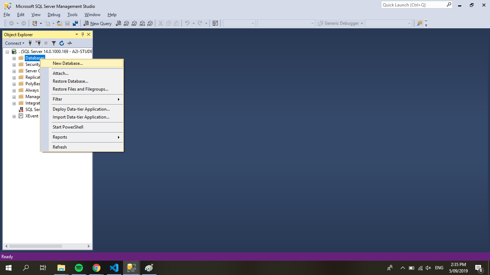
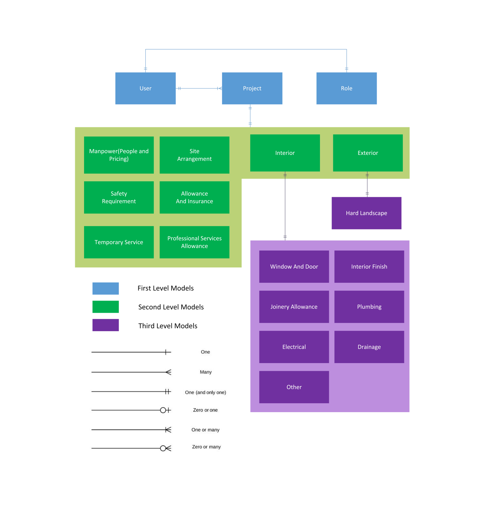

`**NOTE**: In Progress, there might be some changes to work on while the development of the project is ongoing`

# YourQS - Developers' Guide

## Getting Started

Hello Aspire2 Students / Developers!

You probably landed on the **QS Collector project** from YourQS.

Here are some requirements for you to study before you start to dive into this project.

- Node.js
- Express.js
- Sequelize with support of MS SQL
- HTML / CSS / Javascript
- ES6
- Bootstrap 4

## Table of Contents

- [YourQS - Developers' Guide](#yourqs---developers-guide)
  - [Getting Started](#getting-started)
  - [Table of Contents](#table-of-contents)
  - [Environment Setup](#environment-setup)
  - [MSSQL - SETUP](#mssql---setup)
  - [Database - Setup](#database---setup)
  - [Enable Login Access using SQL Authentication](#enable-login-access-using-sql-authentication)
  - [Installation of QS Collector](#installation-of-qs-collector)
  - [1.2. Coding Standards - Syntax and Naming Standards](#12-coding-standards---syntax-and-naming-standards)
  - [1.3. File Structure](#13-file-structure)
    - [Top-level directory structure of our QS Collector](#top-level-directory-structure-of-our-qs-collector)
  - [1.4. Models Visualisation](#14-models-visualisation)

## Environment Setup

Prequisites for our web application:
1. Node 10.16.x
2. Git
3. MSSQL 2017 Developer Edition & Install SMSS
    > **Note**:  We provided an installer for you. you can download it [here](https://drive.google.com/open?id=18WV9k-uKgz79c869GAs4QrJlXtV4Tm5S)
4. Visual Studio Code (can be any text editor that you preferred)

## MSSQL - SETUP
Assuming we have successfully enabled MSSQL. We will enable SQL Authentication for enable us to connect any web application to this database environment.
   1. Open MSSQL
       
      
   2. A modal will appear
   3. put `.` as a `Server Name` and click `Connect` Button
   4. Right Click on SQL Instance "." > Click Properties.
       
      
   5. A popup window will appear > under "Select a Page" list click "Security" and follow these configuration.
       
      

## Database - Setup
  1. Create a new database.
  
  2. Put your desired `Database Name`
  
  3. On options set your `Collation` as `SQL_Latin1_General_CP1_CS_AS`
  

## Enable Login Access using SQL Authentication
   1. On right-clicking on Security/*user_name*
   2. Click Properties
   3. Go on Status and configure based on this image:
   

## Installation of QS Collector

1. Clone the [qs-collector](https://github.com/yourqs-team/qs-collector) repository on github.
2. Open the project on `Visual Studio` or any text editor.
3. duplicate `.env.sample` and rename the duplicated file into `.env`
4. follow these environment variables [here](https://gist.github.com/roaldjap/cb7f621d905231cd106637f5f7263e2e)
5. duplicate `config.json.sample` and rename the duplicated file into `config.json`
6. based on your setup of the database on SQL Server, you should match the credentials on `config.json`
7. run `npm install` - to install dependencies of our web application.
8. run `node_modules/.bin/sequelize db:migrate` - to migrate the database schema to your MSSQL server
  
  > **NOTE**: if you have error: failed to connect to localhost:1433.	
- please enable your tcp port by following instructions [here](https://docs.microsoft.com/en-us/sql/database-engine/configure-windows/configure-a-server-to-listen-on-a-specific-tcp-port?view=sql-server-2017)
  
- then, restart computer
  
> **NOTE**: if you have error: failed to login as 'some_user_here':

- please enable SQL Authentication & Grant Access on your user by following instructions [here](#enable-login-access-using-sql-authentication)
- To make sure everything is working, change your password on your 'sa' user on SQL Management Studio

9. On `.env` file, set your environment variable `SEQUELIZE_FORCE_SYNC_SCHEMA="ON"` and run 'npm start' and follow the instructions indicated   **OR** &nbsp;&nbsp;proceed on next step.

10.  Set your `SEQUELIZE_FORCE_SYNC_SCHEMA="OFF"` on your environment variables(/.env).

11.  run `node_modules/.bin/sequelize db:seed:all` - to initialize all initial data needed for the app to open
	More information about sequelize migrations [here](https://sequelize.org/master/manual/migrations.html)
12. run `npm start` - to start application

## 1.2. Coding Standards - Syntax and Naming Standards

The current project is using multiple disciplines and approach from web development world. We have different coding standards for each language that we used in the project. As a developer, you need to study some of the things here to maintain a readable code to ensure the future progress of this project.

- **Pug(HTML)**: - [https://pugjs.org/api/getting-started.html](https://pugjs.org/api/getting-started.html)
- **CSS**: - [http://getbem.com/naming/](http://getbem.com/naming/)
- **SCSS(CSS):** - [https://sass-lang.com/documentation/syntax](https://sass-lang.com/documentation/syntax)
- **Javascript**: - [https://github.com/airbnb/javascript](https://github.com/airbnb/javascript)
- **Model Definitions** - https://sequelize.org/master/manual/models-definition.html

## 1.3. File Structure

### Top-level directory structure of our QS Collector

    .
    ├── bin                   # bin/ folder contains `www` which holds the server file to run `app.js`
    ├── config                # config/ folder should contain database configuration(config.json).
    ├── controllers           # managing the data of the application that comes from `views` to `models` and vice versa.
    ├── handlers              # used for handling node modules and plugins that can be reused on other JS files
    ├── migrations            # contain `sequelize` scripts for database schema
    ├── models                # contain models we define in `sequelize` -
    ├── public                # contain static files such as image/js/sass(css)/plugins
    ├── routes                # contain index.js where it contains different routes for your `contollers`
    ├── seeders               # contain scripts for generating initial data for our application
    ├── views                 # contain your .pug(html) files / Front End
    .env.sample               # should be duplicated as `.env` and fill your environment variables/credentials
    .gitignore                # contains ignored files in git
    app.js                    # This is we invoke and initialize our `express` app / node modules and run it. 
    helpers.js                
    package-lock.json
    package.json              # scripts / dependencies for our app.
    webpack.config.json       # use it as a compiler for our static files like `sass`

## 1.4. Models Visualisation

YourQS Project Scope Form can have a lot of data involved. We created this visualisation in order for the team can visualise its models.

On the diagram below, shows the visualisation of relationships for each model that we define to our express app.

Each developer must be reminded that these are the foundation of our database.

In a nutshell, the diagram above shows:

- A `User` can have a `Role`.
- A `User` can have multiple `Project`s
- A `Project` contains of sub-models and each of the project it can only have one:
  - `Manpower` Model -> **People And Pricing**
  - `SiteArrangement` Model
  - `SafetyRequirement` Model
  - `AllowanceAndInsurance` Model
  - `TemporaryService` Model
  - `ProfessionalServicesAllowance` Model
  - `Interior` Model
    - An `Interior` Model can only have one:
      - `WindowAndDoor` Model
      - `InteriorFinish` Model
      - `JoineryAllowance` Model
      - `Plumbing` Model
      - `Electrical` Model
      - `Drainage` Model
      - `Other` Model
  - `Exterior` Model
    - An `Exterior` Model can only have one: - `Hard LandScape` Model
      > All of the models mentioned are belongs to `Project` Model.

We designed this model architecture so that, it can be modular if some section of the project scope form needs modification.The team decided not to put it on a JSON datatype because of the limitation of MSSQL Database that was integrated to our app.
